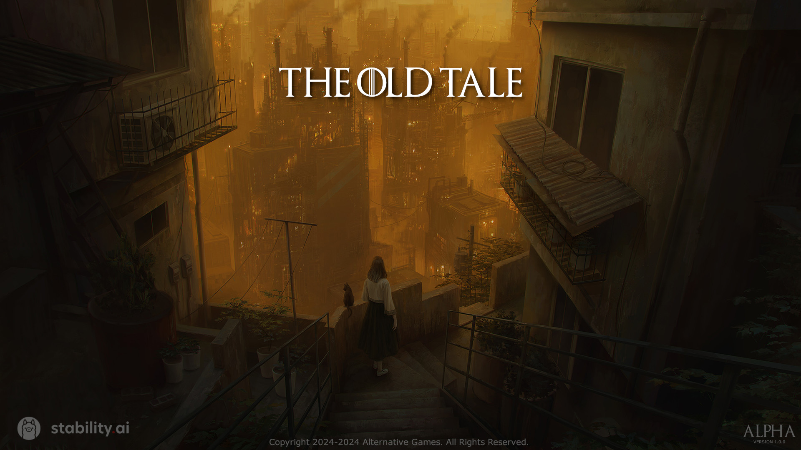
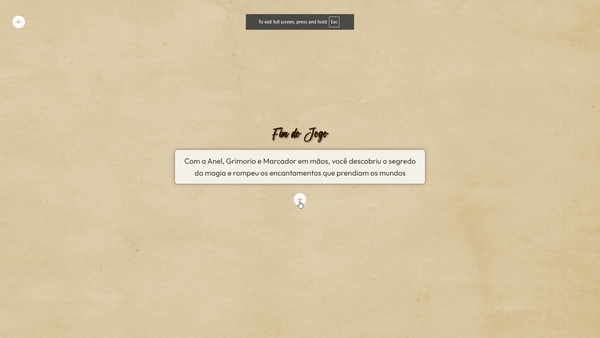

# **The Old Tale**

**The Old Tale** é um jogo clicker que utiliza inteligência artificial para gerar imagens e textos de forma generativa.

<div align="center">
  
</div>

---

## **Tecnologias Utilizadas**

<div align="center">
  
  
  
  
  
  
  
</div>

---

## **Índice**

- [Instalação](#instalação)
- [Instalação de APIs](#instalação-de-apis)
- [Atualizar Projeto Local](#atualizar-projeto-local)
- [Iniciando Projeto Localmente](#iniciando-projeto-localmente)
- [Login](#login)
- [Final do Game](#final-do-game)
- [Social](#social)
- [License](#license)

---

## **Instalação**

### **1. Pré-requisitos**

Certifique-se de ter as seguintes ferramentas instaladas:
- [Git](https://git-scm.com/downloads)
- [Node.js](https://nodejs.org/)

### **2. Clone o repositório**

Crie uma pasta no local desejado, abra o terminal nela e execute o comando abaixo:

```bash
git clone https://github.com/sCesca/TheOldTale.git
```

3. **Instalar Dependências**: Utilize o ```npm install``` no terminal do projeto (para abrir o terminal basta clicar no VSCODE em "View" e "Terminal" que vai abrir um terminal novo) para instalar todas as dependências como React.js e relacionados. Vale lembrar que é **necessário ter instalado o Node.js** .

## Instalação de APIs 🌐

Para a construção do projeto, utilizamos as seguintes APIs:

### Geração de Imagens 🎨

- **Stable Diffusion:** (https://github.com/AUTOMATIC1111/stable-diffusion-webui)
- **Modelos Utilizados**:
  - **Modelo DreamShaper 8:** https://civitai.com/models/4384/dreamshaper
  - **Lora Ancient Sketch:** https://civitai.com/models/309555/paper-backgroundvintage-and-ragged-paper-background-game-prop-hand-drawn-draft
  - **Lora Add Details:** https://civitai.com/models/58390/detail-tweaker-lora-lora
   
3. Para **geração de textos** durante a gameplay, o setup do Ollama também foi necessário (https://github.com/AUTOMATIC1111/stable-diffusion-webui)

   2.1 Modelo utilizado no Ollama: llama3.1

## Iniciando Projeto Localmente

- Após instalar tudo necessário você pode iniciar o projeto com o comando ```npm run dev``` e basta segurar 'CTRL+CliqueEsquerdo' no link para abri-lo no browser. Depois disso abra outro terminal e digite ```python server``` depois aperte TAB ai o server vai virar ```.\server.py```, ai sim você pode dar ENTER.

- É necessário que o Stable Diffusion esteja rodando em conjunto com o setup Ollama

## Login


## Final do Game


